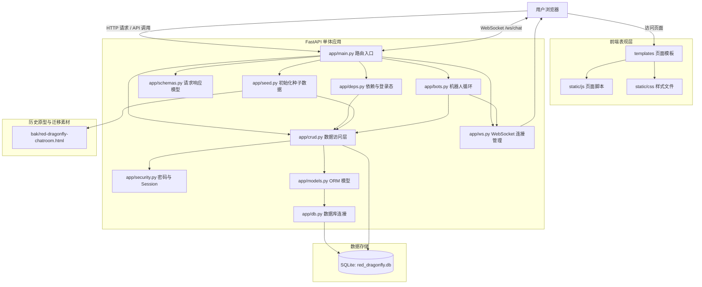
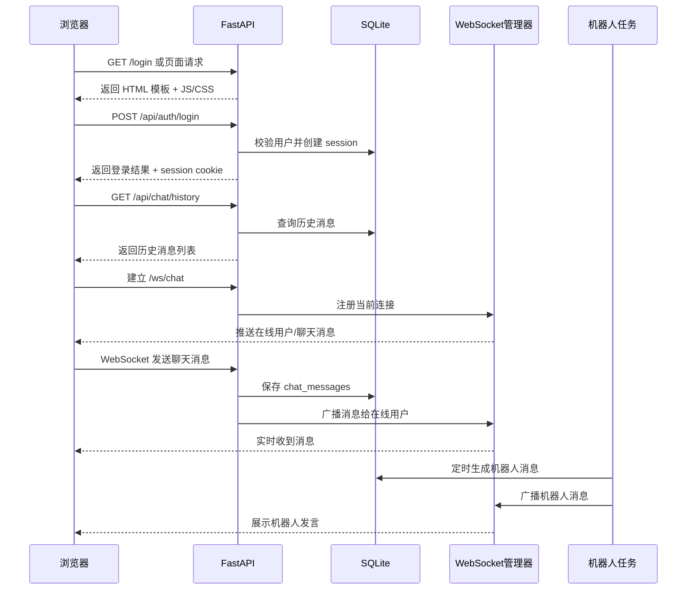

# Red 项目技术架构与功能模块

## 1. 项目定位

`red` 是一个简单聊天室项目，当前采用单体 Web 应用架构，后端基于 FastAPI，前端使用服务端模板加原生 JavaScript，数据存储使用 SQLite，聊天室实时通信通过 WebSocket 实现。

项目同时保留了早期静态原型文件与当前可运行版本：

- 当前运行版本主要位于 `app/`、`templates/`、`static/`
- 早期页面原型和历史素材保留在根目录旧文件与 `bak/` 目录中

---

## 2. 技术架构总览

### 2.1 架构形态

项目采用前后端一体的单体架构：

- 后端服务：FastAPI
- 页面渲染：Jinja2 Templates
- 静态资源：原生 HTML / CSS / JavaScript
- 数据访问：SQLAlchemy ORM
- 数据库：SQLite
- 实时通信：WebSocket
- 身份认证：基于 Cookie 的 Session

### 2.2 技术栈

根据 `requirements.txt`，核心依赖如下：

- `fastapi`
- `uvicorn`
- `sqlalchemy`
- `passlib`
- `pydantic`
- `jinja2`
- `websockets`

### 2.3 分层结构

#### 表现层

负责页面展示和浏览器侧交互：

- `templates/`：页面模板
- `static/css/`：样式文件
- `static/js/`：前端脚本

#### 接口层

由 `app/main.py` 统一提供：

- 页面路由
- JSON API
- WebSocket 路由
- 静态文件挂载

#### 业务与数据访问层

由以下模块配合完成：

- `app/crud.py`：数据库增删改查
- `app/deps.py`：依赖注入、登录态解析
- `app/security.py`：密码哈希、Session Token 生成
- `app/schemas.py`：请求和响应模型校验

#### 数据模型层

由 `app/models.py` 定义 ORM 模型与表结构。

#### 基础设施层

- `app/db.py`：数据库连接、SessionLocal、Base
- `app/ws.py`：WebSocket 连接管理
- `app/seed.py`：初始化种子数据
- `app/bots.py`：机器人用户与自动发言逻辑

---

## 3. 目录结构说明

```text
red/
├─ app/
│  ├─ main.py          # FastAPI 入口，页面/API/WebSocket 路由
│  ├─ models.py        # SQLAlchemy 数据模型
│  ├─ crud.py          # 数据访问逻辑
│  ├─ schemas.py       # Pydantic 请求/响应模型
│  ├─ deps.py          # 数据库依赖、当前用户依赖
│  ├─ db.py            # 数据库连接配置
│  ├─ security.py      # 密码哈希、token、session 有效期
│  ├─ ws.py            # WebSocket 连接管理器
│  ├─ seed.py          # 首次启动种子数据初始化
│  └─ bots.py          # 机器人逻辑
├─ templates/          # 页面模板
├─ static/
│  ├─ css/             # 全站样式
│  └─ js/              # 页面脚本
├─ bak/                # 旧版页面/素材，用于迁移和种子初始化
├─ red_dragonfly.db    # SQLite 数据库文件
└─ requirements.txt    # Python 依赖
```

---

## 4. 网站技术架构说明

### 4.0 架构图（Mermaid）



### 4.1 后端架构

后端以 `FastAPI` 为核心，承担以下职责：

- 提供页面访问入口
- 提供登录、资料、留言板、后台管理等 REST API
- 提供聊天室 WebSocket 实时消息能力
- 启动时自动建表与初始化默认数据

### 4.2 前端架构

前端不是 SPA，也不是 React/Vue 项目，而是传统多页面结构：

- 服务端返回 HTML 模板
- 浏览器加载对应页面脚本
- 页面脚本通过 `fetch` 请求 REST API
- 聊天页面通过 `WebSocket` 实现实时收发消息

这种结构的特点是：

- 简单直接
- 开发成本低
- 部署轻量
- 适合中小型聊天室项目

### 4.3 数据架构

项目当前使用 SQLite，特点是：

- 无需单独安装数据库服务
- 适合本地运行和轻量部署
- 数据直接存储在 `red_dragonfly.db`

数据库通过 SQLAlchemy ORM 访问，不直接在业务代码中大量拼 SQL。

### 4.4 认证架构

项目采用 Cookie + Session 的方式维持登录状态：

1. 用户注册或登录成功
2. 后端创建 `sessions` 表记录
3. 服务端下发 `session` Cookie
4. 后续请求通过 Cookie 识别当前用户
5. 受保护页面和接口通过依赖校验登录状态

### 4.5 实时通信架构

聊天室的实时能力来自 WebSocket：

1. 前端进入聊天页后先拉取历史消息
2. 随后连接 `/ws/chat`
3. 用户发言通过 WebSocket 发送到后端
4. 后端保存消息到数据库
5. 后端将消息广播给在线用户

支持两类消息：

- 公屏消息
- 私聊/定向消息

### 4.6 初始化与兼容架构

项目保留了从旧聊天室页面迁移过来的内容，启动时会做以下事情：

- 自动建表
- 从 `bak/red-dragonfly-chatroom.html` 提取机器人和历史内容
- 初始化机器人账号、聊天记录和留言板数据
- 启动后台机器人循环，在有人在线时模拟发言

这说明当前项目并不是完全从零重写，而是在旧静态聊天室原型基础上做了服务端化改造。

### 4.7 核心请求流转图（Mermaid）



---

## 5. 功能模块清单

### 5.1 用户认证模块

功能包括：

- 用户注册
- 用户登录
- 用户退出登录
- 当前登录用户识别
- Session 状态维护

对应能力：

- 注册接口：`/api/auth/register`
- 登录接口：`/api/auth/login`
- 登出接口：`/logout`
- 当前用户接口：`/api/me`

### 5.2 聊天大厅模块

这是项目核心模块，功能包括：

- 进入聊天大厅
- 加载历史聊天记录
- WebSocket 实时收消息
- 发送普通聊天消息
- 发送动作消息
- 发送私聊消息
- 设置字体样式和颜色
- 查看在线用户
- 选择房间

主要页面：

- `/`

主要接口：

- `/api/chat/history`
- `/api/chat/online`
- `/api/chat/room`
- `/ws/chat`

### 5.3 在线用户模块

功能包括：

- 展示当前在线用户
- 展示管理员身份
- 支持点击用户名进行私聊回复
- 统计在线人数

在线用户来源包括：

- 当前 WebSocket 活跃连接
- 最近活跃的 Session 用户
- 系统机器人用户

### 5.4 房间切换模块

功能包括：

- 前端切换房间展示
- 后端记录用户当前房间

当前实现特点：

- 已记录用户所在房间
- 但聊天消息广播仍以全局广播为主
- 房间更偏向“界面/状态层面的房间”，还不是严格隔离的频道架构

### 5.5 个人资料模块

功能包括：

- 查看自己的资料
- 修改昵称
- 修改性别
- 修改头像符号
- 修改城市、邮箱、QQ、签名、年龄
- 查看其他用户资料

主要页面：

- `/profile`
- `/settings`

主要接口：

- `/api/profile/me`
- `/api/users/{user_id}`

### 5.6 留言板模块

功能包括：

- 浏览留言列表
- 发布留言
- 回复留言
- 删除自己的留言
- 删除自己的回复
- 管理员删除任意留言/回复

主要页面：

- `/guestbook`

主要接口：

- `/api/guestbook`
- `/api/guestbook/{post_id}/reply`
- `/api/guestbook/{post_id}`
- `/api/guestbook/reply/{reply_id}`

### 5.7 后台管理模块

功能包括：

- 管理员查看用户列表
- 管理员查看留言列表
- 管理员删除指定用户

主要页面：

- `/admin`

主要接口：

- `/api/admin/users`
- `/api/admin/posts`
- `/api/admin/user/{user_id}`

### 5.8 机器人模块

功能包括：

- 初始化机器人账号
- 机器人自动出现在在线列表中
- 定时自动发言
- 从旧版页面继承机器人昵称、颜色和部分历史内容

这个模块主要用于：

- 增强聊天室活跃感
- 弥补真实在线人数较少时的冷启动体验

### 5.9 帮助页面模块

功能包括：

- 展示聊天帮助
- 承载规则说明或使用说明

主要页面：

- `/help`

---

## 6. 核心数据表设计

### 6.1 `users`

用户主表，存储：

- 用户名
- 密码哈希
- 性别
- 是否管理员
- 注册时间

### 6.2 `profiles`

用户资料扩展表，存储：

- 头像
- 城市
- 邮箱
- QQ/OICQ
- 个性签名
- 年龄

### 6.3 `sessions`

登录会话表，存储：

- 用户 ID
- Session Token
- 创建时间
- 过期时间
- 最近活跃时间

### 6.4 `chat_messages`

聊天消息表，存储：

- 发送者
- 消息内容
- 字体颜色
- 样式
- 私聊目标用户
- 是否动作消息
- 是否系统消息
- 创建时间

### 6.5 `guestbook_posts`

留言板主贴表。

### 6.6 `guestbook_replies`

留言板回复表。

### 6.7 `user_rooms`

用户当前房间状态表，用于记录用户选择的聊天室房间。

---

## 7. 页面与模块对应关系

| 页面 | 作用 | 对应模块 |
| --- | --- | --- |
| `/login` | 登录/注册入口 | 用户认证模块 |
| `/` | 聊天大厅 | 聊天大厅模块、在线用户模块、房间模块 |
| `/guestbook` | 留言板 | 留言板模块 |
| `/settings` | 编辑个人信息 | 个人资料模块 |
| `/profile` | 查看资料 | 个人资料模块 |
| `/help` | 帮助说明 | 帮助页面模块 |
| `/admin` | 管理后台 | 后台管理模块 |

---

## 8. 当前架构特点总结

### 优点

- 技术栈简单，容易维护
- 前后端放在一个服务里，部署成本低
- 支持基础实时聊天能力
- 支持登录、资料、留言板、后台管理等完整闭环
- SQLite 适合本地和轻量场景
- 保留旧站风格，改造成本较低

### 局限

- 单体架构适合小规模，不适合高并发扩展
- SQLite 不适合多实例和高写入并发
- 房间能力当前更偏展示层，不是严格频道隔离
- 前端为原生 JS，多页面逻辑分散，后续复杂度上升后维护成本会增加
- WebSocket 连接管理目前是单进程内存态，不适合多实例横向扩展

---

## 9. 一句话总结

`red` 当前是一个基于 `FastAPI + SQLite + Jinja2 + 原生 JS + WebSocket` 的轻量级单体聊天室网站，已经具备用户认证、实时聊天、留言板、资料管理、后台管理和机器人陪聊等核心能力，适合小型社区或复古风聊天室场景。
